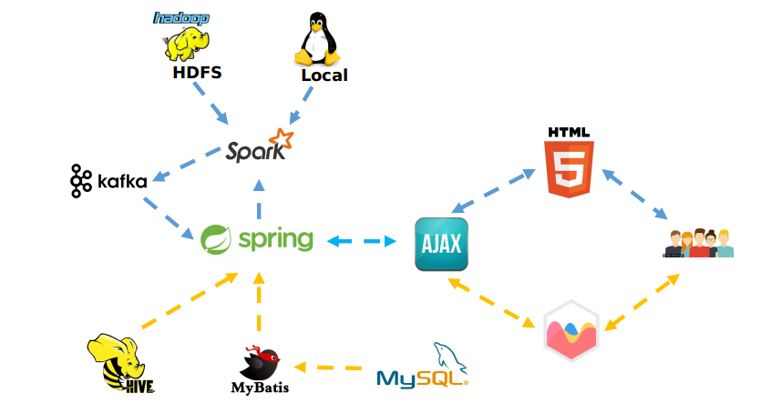

# Graduation-Program

aliadclick: It is the source code of big data platform, which integrates the connection of spark, hive and Kafka. Front end chart.js Exhibition

sparkpredict: It mainly includes calling spark to execute prediction code and spark data preprocessing code. The project has been typed as jar package and placed in the out directory.

readfile.sh: shell script file, statistics file in addition to the number of lines in the space, see the file for detailed use

### 总体设计图如下

